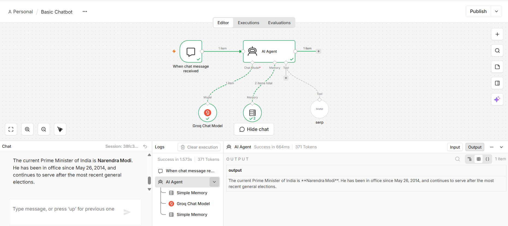

# 🤖 Simple AI Chatbot using n8n

My first AI chatbot workflow built using **n8n**.

## 🚀 About the Project

This project is a simple AI chatbot created using n8n. The workflow receives a user's message, processes it using an AI model, and returns an AI-generated response.

## 🛠️ Technologies Used

* n8n
* AI/LLM Model
* Chat Trigger
* AI Agent
* Memory

## 🔄 Workflow

User Message
↓
Chat Trigger
↓
AI Agent
↓
AI Model
↓
Response to User

## 📸 Workflow

## 📂 Files

* `workflow.json` — Exported n8n workflow
* `screenshots/` — Workflow screenshots

## 🎯 What I Learned

* How n8n workflows work
* Difference between an AI Agent and a basic LLM
* How to connect an AI model to n8n
* How to create a basic chatbot
* How workflow nodes communicate with each other

## 👨‍💻 Author

Shankar Patil

This is my first n8n automation project, and I plan to build more advanced AI automation workflows.
